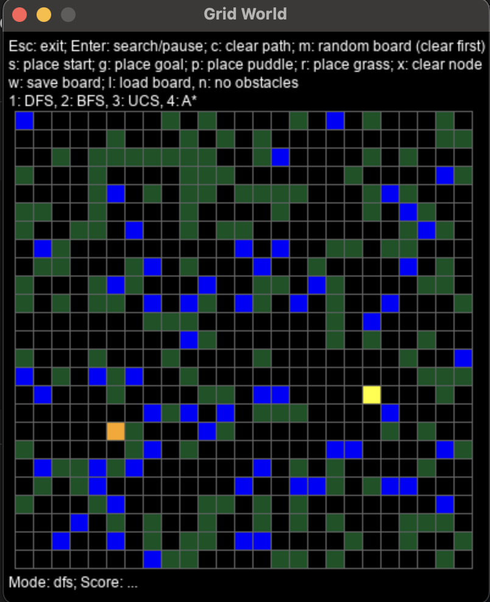

# Assignment 1: Grid World Pathfinding

**Course**: CSE 150B - Artificial Intelligence for Games  
**Language**: Python  
**Library**: PyGame  
**Status**: 🔒 Code not published due to university academic policy

---

## 📌 What I Did

- Fixed bugs in the given DFS implementation
- Implemented Breadth-First Search (BFS), Uniform Cost Search (UCS), and A* Search from scratch
- Designed and tested the algorithms on 20+ map cases, including custom patterns like spiral and zigzag
- Used a priority queue to optimize A* and UCS performance

---

## ⚙️ Technologies Used

- Python 3.10
- PyGame for real-time visualization
- Custom map loader and UI (provided)

---

## 🖼️ Output

## ▶️ Demonstration

▶️ [Click here to watch the video on YouTube!](https://youtube.com/shorts/UFhhSYBn1C4?feature=share)
(Pineapple Kim is my creator alias on YouTube.)
