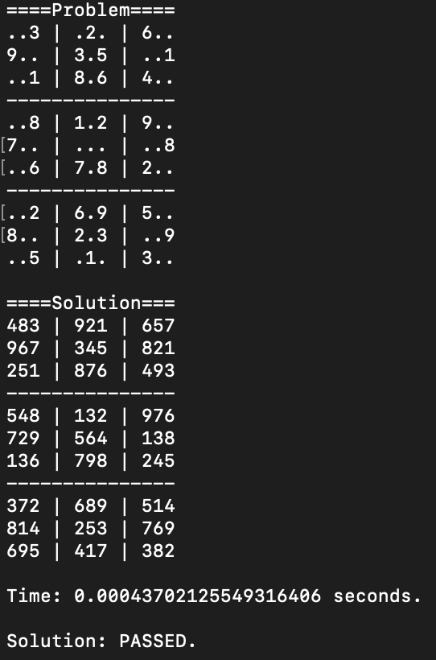

# Assignment 5: Sudoku – Constraint Solver & SAT Encoding (Extra Credit)

**Course**: CSE 150B - Artificial Intelligence for Games  
**Language**: Python  
**Status**: 🔒 Code not published due to university academic policy  

---

## 📌 What I Did

- Implemented a **Constraint Satisfaction Problem (CSP)** solver for Sudoku using:
  - Constraint propagation
  - Backtracking search
  - (Optional) Minimum Remaining Values (MRV) heuristic

---

## ⚙️ Technologies Used

- Python 3.10  
- Backtracking with Constraint Propagation  
- CNF Encoding for SAT Solvers  
- SAT Solver: PicoSAT  
- 20-second timeout per puzzle (for testing)

---

## Output

---

## 🛑 Note

This assignment was part of CSE 150B at UC San Diego.  
The code is excluded in accordance with the university’s academic integrity policy.
